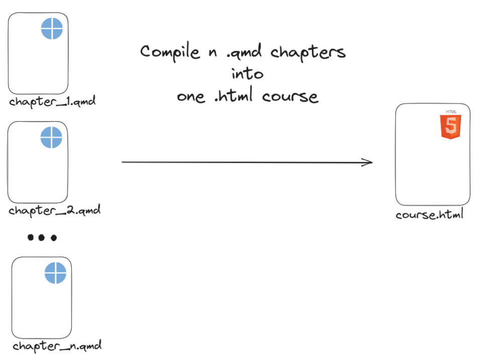

<!-- README.md is generated from README.Rmd. Please edit that file -->

```{r, include = FALSE}
knitr::opts_chunk$set(
  collapse = TRUE,
  comment = "#>"
)
```

# {nq1h}: n qmd to 1 html 

<!-- badges: start -->
<!-- badges: end -->

The goal of {nq1h} is to compile n .qmd presentations to one single html file.

The main purpose of this is to create custom slide decks from several 
chapter .qmd files.

The resulting html file follows the ThinkR quarto theme: [thinkr-open/quakr](https://github.com/ThinkR-open/quakr)



## Installation

```{r eval=FALSE}
if (!requireNamespace("remotes")) {install.packages("remotes")}
if (!requireNamespace("git2r")) {install.packages("git2r")}

options(
  remotes.git_credentials = git2r::cred_user_pass(
    "gitlab-ci-token", 
    Sys.getenv("FORGE_PAT")
  )
)

remotes::install_git(
  "https://forge.thinkr.fr/thinkr/thinkrverse/poc_and_reprex/nq1h", 
  upgrade = "never"
)

```

## External dependencies

This package relies on quarto > 1.3.

Link to quarto: [download page](https://quarto.org/docs/download/)

## How to use it

```{r}
library(nq1h)
```

Given a vector containing path to several .qmd chapters.

```{r}
courses_path <- system.file(
  "courses",
  package = "nq1h"
)

qmds <- list.files(
  path = courses_path,
  full.names = TRUE,
  recursive = TRUE,
  pattern = "qmd$"
)

qmds
```

And a directory where you want your course to be generated.

```{r}
# generate html in temp folder
temp_dir <- tempfile(pattern = "compile")
```

You can use the function `compile_qmd_course()` to compile 
a course.

```{r}
html_output <- compile_qmd_course(
  vec_qmd_path = qmds,
  output_dir = temp_dir,
  output_html = "complete_course.html"
)
```

Check out the result
```{r eval=FALSE}
browseURL(html_output)
```

Clean temporary example directory.

```{r}
unlink(temp_dir, recursive = TRUE)
```

## Devs

### Project Management

The project management of this package (issues, milestones etc...) is done within the 
[thinkr/thinkrverse/formation](https://forge.thinkr.fr/thinkr/thinkrverse/formation/) repo.

The general specifications the package is to meet can be found
here: [Spécifications Techniques de l’outil de création de cours](https://www.notion.so/thnkr/Sp-cifications-Techniques-de-l-outil-de-cr-ation-de-cours-52bd760e477c4f64b37a1230c927d386)

### Keeping ThinkR quarto theme up-to-date

This package is harboring another project [quakr](https://github.com/ThinkR-open/quakr) which is the ThinkR
theme for the quarto revealjs format.

It is not a R package but a quarto extension stored in `inst/`.

It should be kept in sync with the main branch of https://github.com/ThinkR-open/quakr 
to insure that {nq1h} is always shipped with the latest release of quakr.

#### Automatic sync check

There is a built-in fail-safe function `.check_if_quakr_up_to_date()` in the project `.Rprofile`.

Every time a dev open the project `.check_if_quakr_up_to_date`:

* downloads the the latest version of quakr in a temp directory 
* checks it against the current version within the package 
* informs the dev if quakr needs to be updated

#### Updating quakr

quakr needs to be updated via the quarto cli.

First, you need to be in the package `inst/` directory where the extension is stored

``` bash
cd inst/
```
Run the `quarto update` command and answer `yes` to all questions

``` bash
quarto update ThinkR-open/quakr
```

If you want to update quakr using a specific branch, use `@` to specifiy 
which branch you would like to use. For example:

``` bash
quarto update ThinkR-open/quakr@dev
```

In that case you will also need to provide thebranch name to
`.check_if_quakr_up_to_date()` in the .Rprofile as such
`.check_if_quakr_up_to_date(branch = "dev")` not to be bothered by
useless warnings.

Lastly, don't forget to get back to the package directory

``` bash
cd ..
```


