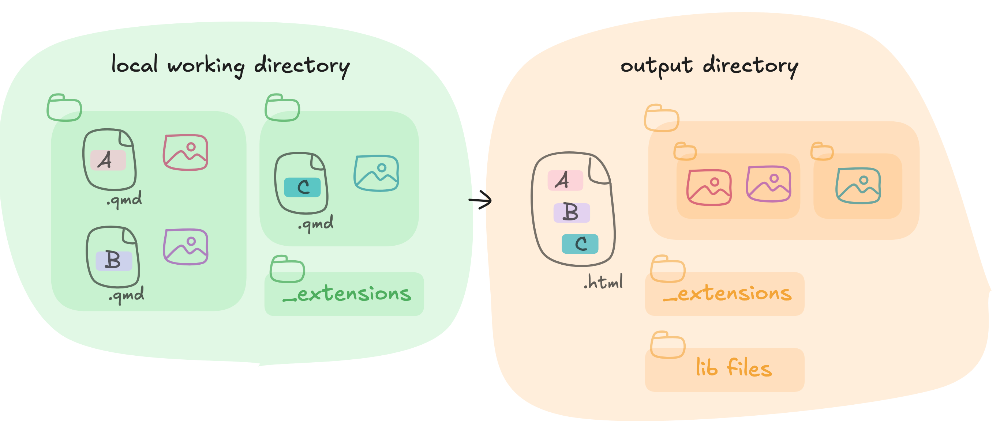

<!-- README.md is generated from README.Rmd. Please edit that file -->

```{r, include = FALSE}
knitr::opts_chunk$set(
  collapse = TRUE,
  comment = "#>"
)
```

# {squash}: several quarto to single html 
<!-- badges: start -->
[](https://github.com/ThinkR-open/squash/actions/workflows/R-CMD-check.yaml)
[](https://app.codecov.io/gh/ThinkR-open/squash)
<!-- badges: end -->

The goal of {squash} is to compile a single html presentation file from multiple independent quarto files.

The main purpose of this is to create custom slide decks from several quarto chapter files.

The resulting revealjs presentation can be themed via quarto extensions.

```{r, fig.align = 'center'}

```

## Installation

You can install the **stable** version from [GitHub](https://github.com/Thinkr-open/squash) with:

```{r eval=FALSE}
remotes::install_github("Thinkr-open/squash", ref = "production")
```


You can install the **development** version from [GitHub](https://github.com/Thinkr-open/squash) with:

```{r eval=FALSE}
remotes::install_github("Thinkr-open/squash", ref = "main")
```

This package relies on quarto > 1.3 (see its [download page](https://quarto.org/docs/download/)).

## Play with {squash}

### TL;DR

Given the vector `qmds` containing paths to one or several qmd revealjs presentation, you can use the function `compile_qmd_course()` to compile a full presentation.

```{r, eval=FALSE}
library(squash)

html_output <- compile_qmd_course(
  vec_qmd_path = qmds,
  output_dir = tempdir(),
  output_html = "complete_course.html"
)
```

Check out the result
```{r eval=FALSE}
browseURL(html_output)
```

### Tutorials

You can find find a full tutorial on how to create your first {squash}-made html [here](https://thinkr-open.github.io/squash/articles/simple-example-usage.html).

Eager to spice it up ? Take a look at some advanced usage doc :

- using quarto themes and extensions: [here](https://thinkr-open.github.io/squash/articles/advanced-usage-theme.html)
- using a personalized template: [here](https://thinkr-open.github.io/squash/articles/advanced-usage-template.html)
- using parallel workers with `{future}`: [here](https://thinkr-open.github.io/squash/articles/advanced-usage-future.html)

## Contribute

Ready to help ? Take a look at the [contribution guidelines](https://thinkr-open.github.io/squash/articles/dev-contribute.html).
