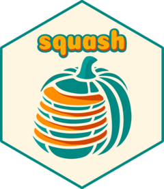

<!-- README.md is generated from README.Rmd. Please edit that file -->

# {squash}: several quarto to single html 

<!-- badges: start -->

[](https://github.com/ThinkR-open/squash/actions/workflows/R-CMD-check.yaml)
[](https://app.codecov.io/gh/ThinkR-open/squash)
<!-- badges: end -->

The goal of {squash} is to compile a single html presentation file from
multiple independent quarto files.

The main purpose of this is to create custom slide decks from several
chapter quarto files.

The resulting html file can be themed via quarto extensions.

## Installation

You can install the **stable** version from
[GitHub](https://github.com/Thinkr-open/squash) with:

``` r
remotes::install_github("Thinkr-open/squash", ref = "production")
```

You can install the **development** version from
[GitHub](https://github.com/Thinkr-open/squash) with:

``` r
remotes::install_github("Thinkr-open/squash", ref = "main")
```

This package relies on quarto \> 1.3 (see its [download
page](https://quarto.org/docs/download/)).

## Play with `{squash}`

### TL;DR

Given a vector `qmds` containing paths to one or several qmd file
chapters, you can use the function `compile_qmd_course()` to compile a
course.

``` r
library(squash)

compile_qmd_course(
  vec_qmd_path = qmds,
  output_dir = tempdir(),
  output_html = "complete_course.html"
)
```

Check out the result

``` r
browseURL(html_output)
```

### Tutorials

You can find find a full tutorial on how to create your first
`{squash}`-made html
[here](https://thinkr-open.github.io/squash/articles/simple-example-usage.html).

Eager to spice it up ? Take a look at some advanced usage doc :

- using quarto themes and extensions :
  [here](https://thinkr-open.github.io/squash/articles/advanced-usage-theme.html)
- using a personalized template :
  [here](https://thinkr-open.github.io/squash/articles/advanced-usage-template.html)
- using parallel workers with `{future}` :
  [here](https://thinkr-open.github.io/squash/articles/advanced-usage-future.html)

## Code of Conduct

Please note that this project is released with a [Contributor Code of
Conduct](https://www.contributor-covenant.org/version/1/0/0/code-of-conduct.html).
By participating in this project you agree to abide by its terms.

## Devs

### Check

Some tests manually verify the appearance of the slides. To trigger
them, please run `devtools::test()` interactively.
