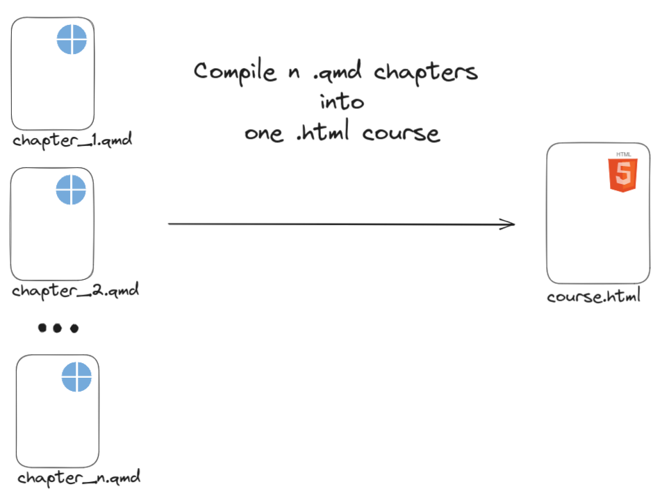

<!-- README.md is generated from README.Rmd. Please edit that file -->

# {nq1h} n qmd to 1 html

<!-- badges: start -->

<!-- badges: end -->

The goal of {nq1h} is to compile n .qmd to one single html file.

The main purpose of this is to create custom slide decks from several
chapter .qmd files.

THe resulting html file follows the ThinkR quarot theme: [{quakr}]()

