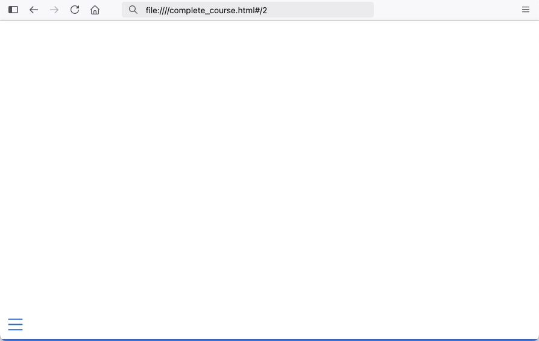
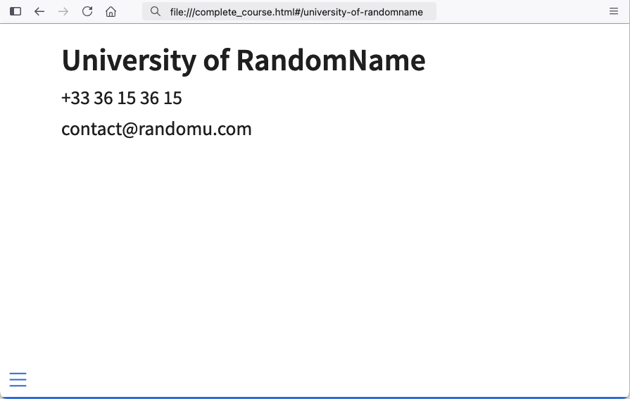
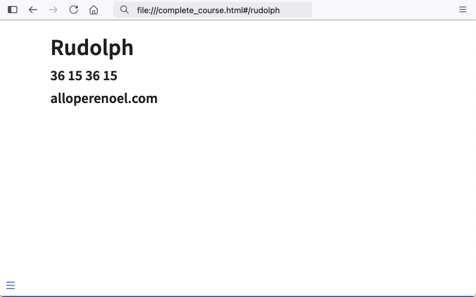

```{r, include = FALSE}
knitr::opts_chunk$set(
  collapse = TRUE,
  comment = "#>"
)
```

```{r, echo=FALSE, eval=FALSE}
# list example qmds
courses_path <- system.file(
  "courses",
  "M01",
  package = "squash"
)

# copy course tree in tmpdir, add quarto porject file
tmp_course_path <- tempfile(pattern = "course")
dir.create(tmp_course_path)
file.create(file.path(tmp_course_path, "_quarto.yaml"))

file.copy(
  from = courses_path,
  to = tmp_course_path,
  recursive = TRUE
)

qmds <- list.files(
  path = tmp_course_path,
  full.names = TRUE,
  recursive = TRUE,
  pattern = "qmd$"
)

# generate html in temp folder
temp_dir <- tempfile(pattern = "compile")
```

## Adding fixed elements in template

By default, `{squash}` will include your quarto chapters into a minimal template with no extra slide other than the title one and an empty last slide.

You can provide a personalized template, with additional content.

The only requirement for your template is to keep the `{{ include_html_content }}` placeholder, as it will be the landing spot for including the chapter slides.

Let's change from using the default template (*left*) to this personalized template (*right*).

:::: {style="display: grid; grid-template-columns: 1fr 1fr; grid-column-gap: 10px;"}

::: {}

::: {style="text-align: center"}
**default template**
:::

```{.md}

{{ include_html_content }}

---

```
:::

::: {}

::: {style="text-align: center"}
**personalized template**
:::

```{.md}

{{ include_html_content }}

---

## University of RandomName

+33 36 15 36 15

contact@randomu.com
```
:::

::::

To do so, I provide the path to my template to the `template` parameter.


```{r, eval=FALSE}
library(squash)

html_output <- compile_qmd_course(
  vec_qmd_path = qmds,
  output_dir = temp_dir,
  output_html = "complete_course.html",
  template = "path/to/template.qmd"
)
```

Now, all compilations with this new template will end with my custom last slide!

:::: {style="display: grid; grid-template-columns: 1fr 1fr; grid-column-gap: 10px;"}

::: {}

::: {style="text-align: center"}
**default last slide**
:::

```{r, echo=FALSE, out.width="100%"}
#| fig.alt: >
#|   A default empty last slide with

```

:::

::: {}

::: {style="text-align: center"}
**personalized last slide**
:::

```{r, echo=FALSE, out.width="100%"}
#| fig.alt: >
#|   A custom last slide with contact detail

```

:::

::::

## Adding variable elements in template

Let's spice it up, what if I want to change contact details for each of my presentations. In that case, no need for a pile of custom templates, you can add **custom placeholders** with the `{{ element }}` syntax.

You can fill their value through the `template_text` parameter. Fell free to add as many new placeholders as you wish, as long as you provide them all with a value in the `template_text` input.

Again, you also need to keep the `{{ include_html_content }}` placeholder somewhere inside your template. 

Let's use the following template and compile command line.

:::: {style="display: grid; grid-template-columns: 1fr 1fr; grid-column-gap: 10px;"}

::: {}

::: {style="text-align: center"}
**personalized template**
:::

```{.md}

{{ include_html_content }}

---

## {{ trainer }}

**{{ phone }}**

**{{ mail }}**
```
:::

::: {}

::: {style="text-align: center"}
**command line**
:::


```{r, eval=FALSE}
library(squash)

html_output <- compile_qmd_course(
  vec_qmd_path = qmds,
  output_dir = temp_dir,
  output_html = "complete_course.html",
  template = "path/to/template.qmd",
  template_text = list(
    "trainer" = "Rudolph",
    "phone" = "36 15 36 15",
    "mail" = "alloperenoel.com"
  )
)
```

:::

::::

I have three placeholders in my last slide:

- the slide chapter name will refer to `trainer`
- two lines styled in bold will refer to `phone` and `mail`

I fill them up with the `template_text` list values, and obtain the following last slide:

::: {style="text-align: center"}
**personalized last slide**
:::

```{r, echo=FALSE, fig.align='center', out.width="50%"}
#| fig.alt: >
#|   A custom last slide with contact detail

```

Cool thing is that, I can now re-use the same template and adapt last slide content by simply adjusting the command line parameters.

```{r, eval=FALSE, echo=FALSE}
# clean up
unlink(temp_dir, recursive = TRUE)
unlink(tmp_course_path, recursive = TRUE)
```
