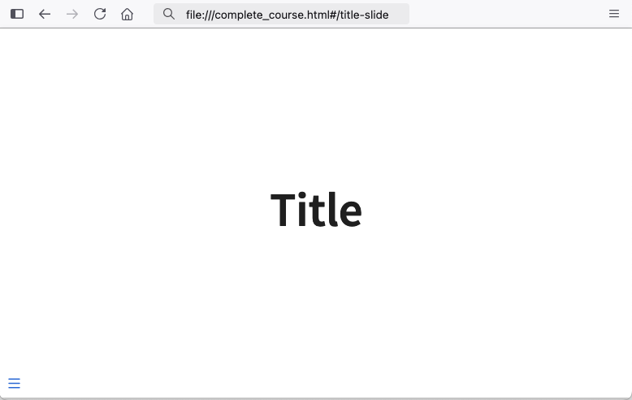
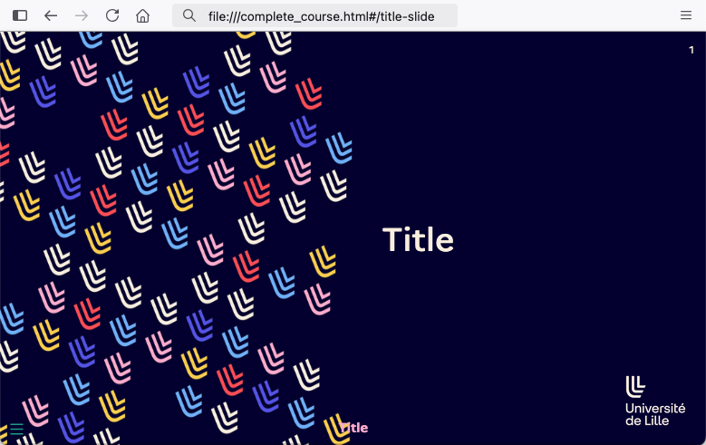
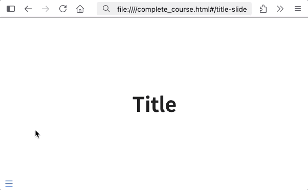

```{r, include = FALSE}
knitr::opts_chunk$set(
  collapse = TRUE,
  comment = "#>"
)
```

```{r, eval=FALSE, echo=FALSE}
# list example qmds
courses_path <- system.file(
  "courses",
  "M01",
  package = "squash"
)

# copy course tree in tmpdir, add quarto porject file
tmp_course_path <- tempfile(pattern = "course")
dir.create(tmp_course_path)
file.create(file.path(tmp_course_path, "_quarto.yaml"))

file.copy(
  from = courses_path,
  to = tmp_course_path,
  recursive = TRUE
)

qmds <- list.files(
  path = tmp_course_path,
  full.names = TRUE,
  recursive = TRUE,
  pattern = "qmd$"
)

# generate html in temp folder
temp_dir <- tempfile(pattern = "compile")
```

## Using quarto themes

Let's say the default quarto theme is somewhat not your style, how could you include your preferred quarto theme ?

To do so, you first need to install your target extension on your machine from your terminal, like you would do for a single quarto revealjs file rendering.

```{.bash}
quarto add ArthurData/quarto-revealjs-lilleuniv
```

Great, now you can use this theme with `{squash}` by providing the target theme as `output_format` and the path to the `_extensions` folder as `ext_dir`.

```{r, eval=FALSE}
html_output <- compile_qmd_course(
  vec_qmd_path = qmds,
  output_dir = temp_dir,
  output_html = "complete_course.html",
  output_format = "lille-univ-dark-revealjs",
  ext_dir = "path/to/_extensions/"
)
```

My slide deck will now bear my custom theme !

:::: {style="display: grid; grid-template-columns: 1fr 1fr; grid-column-gap: 10px;"}

::: {}

::: {style="text-align: center"}
**default theme slides**
:::

```{r, echo=FALSE, out.width="100%"}
#| fig.alt: >
#|   A defaut first slide with blank background

```
:::

::: {}

::: {style="text-align: center"}
**custom theme slides**
:::

```{r, echo=FALSE, out.width="100%"}
#| fig.alt: >
#|   A custom first slide with lille university theme

```
:::

::::

## Using quarto plugins

Cool right? But let's go further and add a couple plugins in the `_extensions` folder!

```{.bash}
quarto add ArthurData/quarto-confetti
quarto add quarto-ext/pointer
```

You can now list these plugins in the `metadata_template` parameters and integrate them in your presentation.

The `metadata_template` input list will be converted as yaml-like parameters and provided to the rendering machinery, as if you had directly written them in the header of your quarto file.

```{r, eval=FALSE}
html_output <- compile_qmd_course(
  vec_qmd_path = qmds,
  output_dir = temp_dir,
  output_html = "complete_course.html",
  metadata_template = list(
    `revealjs-plugins` = list("confetti", "pointer")
  ),
  ext_dir = "path/to/_extensions/"
)
```

Now, I can throw confetti by pressing `c` and get my pointer with `q` 🎉.

```{r, echo=FALSE, fig.align='center', out.width="60%"}
#| fig.alt: >
#|   A default first slide with confetti throwing and pointer activation

```

## A note on extensions

* Metadata and parameters set in the `compile_qmd_course` will supersede the parameters detected inside the quarto header and/or the quarto project metadata files.

* In order to use themes and plugins, you can only provide a single `_extensions` folder via the `ext_dir` parameter, so make sure all the necessary plugins and themes are installed in there.

* You can edit the metadata a the template level (`metadata_template` input) and/or the individual chapter level (`metadata_qmd` input). It is usually best for plugins and themes to be applied at the template level (which will be the wrapper of the main html output file). Chapter-level metadata may be usefull to remove some overlapping content (e.g. logo, footer).

* When rendering a quarto file with extensions, `{squash}` will provide access tho the target `_extensions` folder. Several cases can be triggered :

  - the file is part of a **quarto project**: the `_extensions` folder is copied in the quarto project root and cleaned after rendering
  - the file is **not** part of a **quarto project**: the `_extensions` folder is copied in the file folder and cleaned after rendering
  - in both cases, if some of the extensions are already present in the target location, a note will be raised in the console and `{squash}` will use the existing extensions without overwriting them.

```{r, eval=FALSE, echo=FALSE}
# clean up
unlink(temp_dir, recursive = TRUE)
unlink(tmp_course_path, recursive = TRUE)
```
