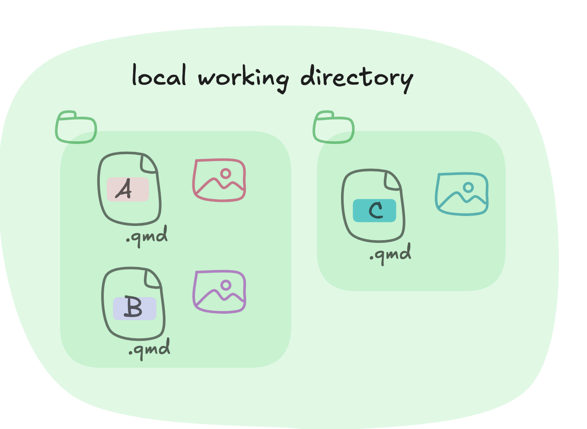
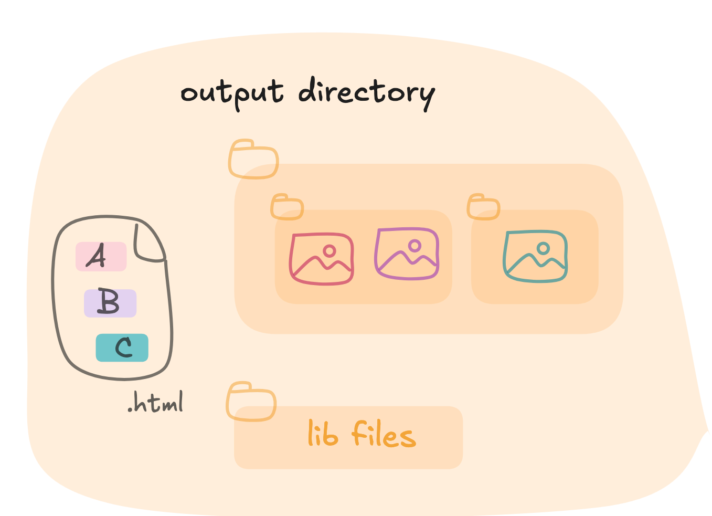

```{r, include = FALSE}
knitr::opts_chunk$set(
  collapse = TRUE,
  comment = "#>"
)
```

## How do I use {squash}?

This is a basic example of combining qmd files into a single html presentation.

Let's say we have two folders with three quarto revealjs presentation files, alongside their images.

```{r, echo=FALSE, fig.align = 'center', out.width="60%"}

```


```{r, eval=FALSE, echo=FALSE}
# list example qmds
courses_path <- system.file(
  "courses",
  "M01",
  package = "squash"
)

# copy course tree in tmpdir
tmp_course_path <- tempfile(pattern = "course")
dir.create(tmp_course_path)

file.copy(
  from = courses_path,
  to = tmp_course_path,
  recursive = TRUE
)

qmds <- list.files(
  tmp_course_path,
  full.names = TRUE,
  recursive = TRUE,
  pattern = "qmd$"
)
```

> Example files are stored in `system.file("courses", "M01", package = "squash")`

I can render a combined html presentation from these quarto files by executing the following command:

```{r, eval=FALSE}
library(squash)

qmds <- c("path/to/A.qmd", "path/to/B.qmd", "path/to/C.qmd")

html_output <- compile_qmd_course(
  vec_qmd_path = qmds,
  output_dir = file.path(tmp_course_path, "complete"),
  output_html = "complete_course.html"
)
```

Tada, I now have a new folder, with my complete html presentation!

```{r, echo=FALSE, fig.align = 'center', out.width="60%"}

```

Inside this output directory you can find the following files:

- **an html file**: the complete revealjs presentation, with content from all input quarto files
- **an image folder**: it will store all images (graph output, png, jpg, etc) organised in sub-folders mimicking the original file tree
- **a companion folder**: like a classic quarto rendering, it will store the necessary libraries to read the revealjs html output

```{r, eval=FALSE, echo=FALSE}
unlink(tmp_course_path, recursive = TRUE)
```

## A note on compilation

* File content will be included in the same order as provided to `compile_qmd_course`.

* `{squash}` can work with quarto files both inside and outside of quarto project, you can even mix them in the same compilation.

* In case of failure to render some files, `{squash}` will erase all temporarily created files before exiting.

* To see a progress bar as compilation is running, you can wrap the function call inside a `progressr::with_progress()`. You can also set it in the console with `progressr::handlers(global = TRUE)`.

* Image files are stored in sub-folders to prevent overriding files with identical names across different original folders. For instance, if two presentations use a `logo.png` that link to two different images, it will be correctly handled in the compiled html.
